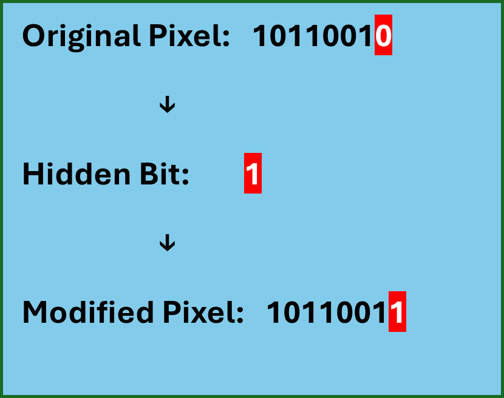
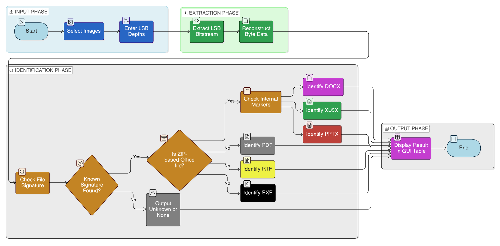
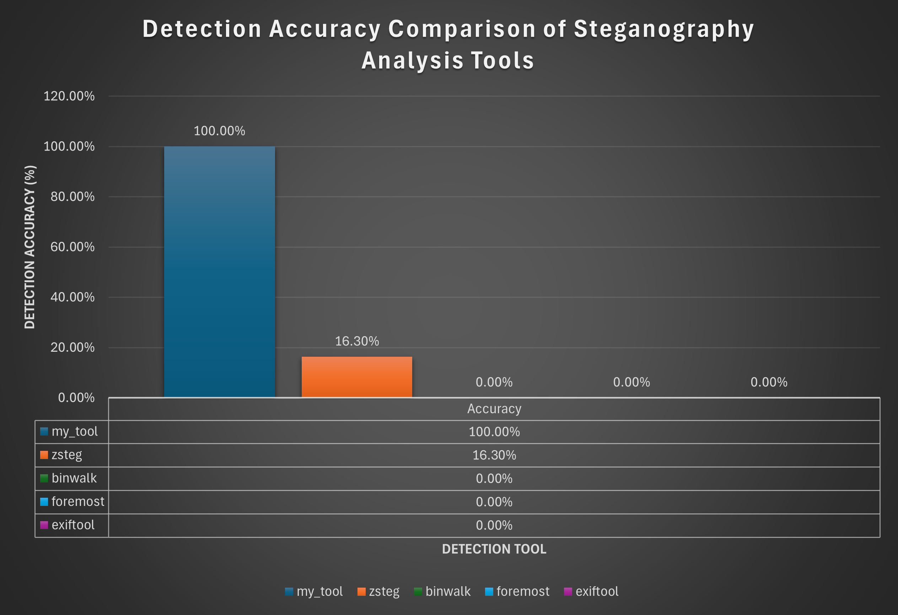
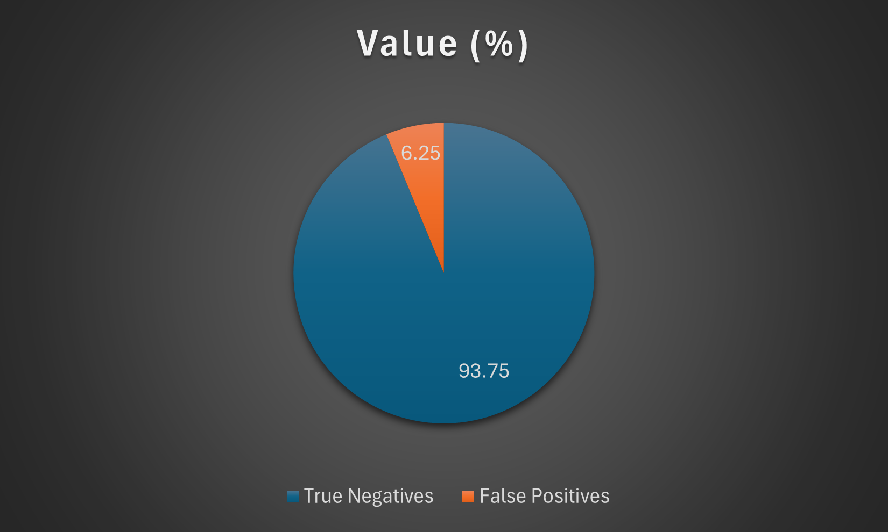

# LSB Stego File Type Detector

A Python-based digital forensics tool for detecting and identifying hidden file types embedded within PNG and BMP images using Least Significant Bit (LSB) steganography.

---

## Overview

Steganography enables covert communication by hiding data within digital media. Among various techniques, **Least Significant Bit (LSB)** steganography is widely used due to its simplicity and minimal visual distortion.

This project focuses on **steganalysis**, specifically:

> Detecting and identifying the **type of hidden payload** (e.g., PDF, DOCX, XLSX, PPTX, RTF, EXE) embedded inside stego images.

Unlike traditional approaches that only detect the presence of hidden data, this tool performs **payload classification**, making it highly valuable for **digital forensics and cybersecurity investigations**.

---

## How LSB Steganography Works

The Least Significant Bit technique embeds hidden data by modifying the lowest bit of pixel values.



Even small modifications allow data to be stored without noticeable visual change, making detection challenging.

---

## Key Features

* Detection of hidden file types from stego images
* Supports PNG and BMP formats
* Identifies:

  * PDF
  * DOCX / XLSX / PPTX
  * RTF
  * EXE
* Multi-LSB support (1–3 bits)
* GUI-based interface (Tkinter)
* Cross-platform compatibility (Windows & Linux)
* Batch evaluation capability

---

## Detection Pipeline

The system follows a structured steganalysis workflow:



### Core Steps

1. Extract pixel data from the image
2. Reconstruct hidden bitstream using LSB extraction
3. Skip metadata tag region
4. Analyse extracted payload using:

   * Magic byte signatures
   * Internal markers (ZIP-based Office formats)
5. Classify detected file type

---

## Project Structure

```text
src/                  Main GUI detector
scripts/              Evaluation and testing scripts
dataset/
  ├── clean/          Clean images (false positive testing)
  ├── stego/          Stego images with embedded payloads
  ├── payloads/       Original embedded files
  └── results/        Ground truth and output CSV files
docs/images/          Diagrams and visual explanations
run.py                Application entry point
```

---

## Installation

```bash
git clone https://github.com/Arka-Paul/lsb-stego-detector.git
cd lsb-stego-detector
pip install -r requirements.txt
```

---

## Running the Tool

Launch the GUI:

```bash
python run.py
```

### Usage

1. Select stego images
2. Enter LSB depth (1–3)
3. Run detection
4. View results in GUI table

---

## Dataset Description

The dataset is designed to simulate realistic steganographic scenarios:

* Image Types:

  * Flat Color
  * Mixed Content
  * Noisy
  * Photographic
  * Transparency

* Payload Types:

  * DOCX
  * PDF
  * XLSX
  * PPTX
  * RTF

* LSB Depths:

  * 1-bit
  * 2-bit
  * 3-bit

This ensures robust evaluation across different embedding conditions.

---

## Evaluation Scripts

Located in `scripts/`:

### 1. evaluate_detector.py

* Computes detection accuracy
* Provides breakdown by:

  * File type
  * LSB depth

### 2. test_false_positives.py

* Evaluates behaviour on clean images
* Measures false detection rate

---

## Tool Comparison Results

The detector was evaluated against common steganalysis tools.



### Summary

| Tool      | Detection Accuracy |
| --------- | ------------------ |
| This Tool | 100%               |
| zsteg     | 16.30%             |
| binwalk   | 0%                 |
| foremost  | 0%                 |
| exiftool  | 0%                 |

This demonstrates the effectiveness of targeted payload classification compared to general-purpose tools.

---

## False Positive Analysis

The tool was tested on clean images to evaluate reliability.



* True Negatives: **93.75%**
* False Positives: **6.25%**

This indicates strong reliability with minimal incorrect detections.

---

## Example Output

The tool generates:

* Predicted file type
* Extracted header (hex format)
* Accuracy metrics (CSV output)
* False positive statistics

---

## Limitations

* Designed primarily for LSB-based steganography
* Reduced effectiveness against:

  * Encrypted payloads
  * Preprocessed/obfuscated embedding (e.g., OpenPuff)
* Requires correct LSB assumption for optimal detection

---

## Research Contribution

This project extends traditional steganalysis by introducing:

> **Automated classification of hidden payload types within stego images**

This provides practical value for:

* Digital forensics investigations
* Malware detection
* Covert communication analysis

---

## Future Work

* Integration of entropy-based detection
* Machine learning classification models
* Support for encrypted payload identification
* Expansion to audio/video steganography

---

## License

This project is licensed under the MIT License.

---

## Author

**Arka Paul**
BSc (Hons) Computer Science (Cyber Security)
University of Greenwich

---

## Disclaimer

This tool is intended for educational and research purposes only.
